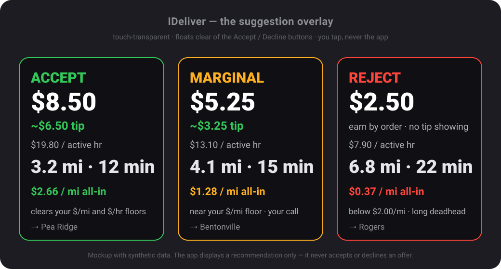

# IDeliver

A personal, on-device Android assistant for gig delivery drivers. It reads
incoming **DoorDash** (and, later, **Uber Eats**) offers, evaluates them against
your own rules, and shows a fast **accept / marginal / decline** suggestion —
with an optional spoken callout — so you can decide in the couple of seconds an
offer gives you.

It does **not** interact with the delivery apps for you. It looks; you tap.



> Mockup with synthetic data. The overlay is touch-transparent and floats clear
> of the Accept / Decline buttons — it shows a recommendation; you make every tap.

---

## What it does

- **Reads offers** the moment they arrive, via the Android
  `NotificationListenerService` (primary) and a read-only accessibility service
  (secondary, for the pay/miles the notification omits).
- **Evaluates the true economics** — not just the headline pay, but all-in
  **$/mile** and **$/hour** across every leg including the unpaid drive home
  (deadhead), with tip estimation, earn-by-time handling, and batched /
  add-to-route awareness.
- **Shows a glance-able overlay** — a touch-transparent suggestion box that
  never sits near the real accept/decline buttons.
- **Speaks the offer** (optional): miles, minutes, the recommendation, estimated
  earnings, and the destination city read from the offer-screen map.
- **Keeps a private log** — an in-app event log plus an on-device odometer /
  mileage record for your own bookkeeping.

Everything happens **on your phone**. Nothing is uploaded.

---

## Sideload only — not on the Play Store

This is a personal-use app, distributed as an APK you build and install
yourself. It is **not** published to the Google Play Store and is not intended
to be. You install it by enabling "install unknown apps" for your file manager
or `adb` and sideloading the APK onto your own device.

---

## ⚠️ Disclaimers — read before using

- **It never accepts or declines for you.** There is no automation, gesture
  injection, or tapping of the DoorDash / Uber apps. The app only displays a
  recommendation; a human makes every decision. This is a deliberate, hard
  design constraint — the whole point is to keep your driver account safe.
- **Advisory only.** Every number (tip estimates, $/hr, $/mi, destination) is a
  best-effort guess from limited on-screen data and may be wrong. Use your own
  judgment. The author is not responsible for accepted/declined offers, missed
  earnings, or account standing.
- **Your data stays on your device.** No analytics, no crash reporters, no
  network calls carrying offer content. Offer text can include customer
  addresses, so it is never transmitted off the phone.
- **Read-only.** The app only reads what Android already surfaces —
  notifications and on-screen content. No credentials, no account scraping, no
  API reverse-engineering.
- **Fragile by nature.** Capture and parsing depend on the exact layout and copy
  of the delivery apps, which change without notice. Expect to re-calibrate after
  their updates. Accessibility-based capture in particular may be restricted by
  future Android versions.
- **Your responsibility.** Whether running an assistant like this is consistent
  with a given platform's terms of service is on you to determine. Provided
  as-is, without warranty of any kind.

---

## Requirements

- Android device on **Android 10 (API 29) or newer**
- A machine with **JDK 17** to build (the repo pins Gradle via the wrapper)
- The Android SDK (`local.properties` with `sdk.dir=...`, not committed)

---

## Build & install

```bash
# 1. Point the build at your Android SDK (not tracked in git)
echo "sdk.dir=/path/to/Android/sdk" > local.properties

# 2. Build the debug APK
./gradlew :app:assembleDebug

# 3. Install to a connected device (USB debugging on)
./gradlew :app:installDebug
# or:  adb install -r app/build/outputs/apk/debug/app-debug.apk
```

## First-run permissions

The app is inert until you grant it what it needs. On first launch, open
Settings inside the app and enable, in order:

1. **Notification access** — lets it read incoming offer notifications
   *(Settings → Notifications → Device & app notifications → IDeliver).*
2. **Accessibility service** — reads the pay/miles the notification leaves out
   *(Settings → Accessibility → IDeliver).* Read-only; the app performs no
   actions on your behalf.
3. **Display over other apps** — for the suggestion overlay
   *(Settings → Apps → Special access → Display over other apps → IDeliver).*
4. **Notifications** (Android 13+) and, if you use the odometer feature,
   **Camera**.

Then mount the phone, start dashing, and the overlay + voice will react to
offers as they come in. It works with the screen locked and does **not** need to
stay tethered to a computer.

## Settings worth setting

- **Home base + radius** — flag offers that drift too far from home
  (`0` = unlimited).
- **Max total time** (`0` = unlimited).
- **$/mile and $/hour floors** — the lines that separate accept / marginal /
  decline.
- **Acceptance-rate target** — nudges borderline calls so you can protect a
  Platinum acceptance rate while still skipping the worst offers.
- **Voice** — toggle spoken callouts on/off.

---

## Project layout

```
app/            activities, settings UI, onboarding + permission flow
core-capture/   notification + accessibility capture, map-read, voice
core-parse/     raw captured text -> Offer
core-rules/     Offer + Settings -> Verdict   (pure Kotlin, unit-tested)
core-overlay/   the floating suggestion box
core-data/      Room, offer log, mileage, settings
core-model/     shared Offer / Verdict types and enums
```

The key seam is the `Offer` type: capture and parsing are the fragile layers,
and nothing downstream of `Offer` knows whether a value came from a
notification, an accessibility node, or OCR.

---

*Personal project. Provided as-is, for personal use, with no warranty.*
